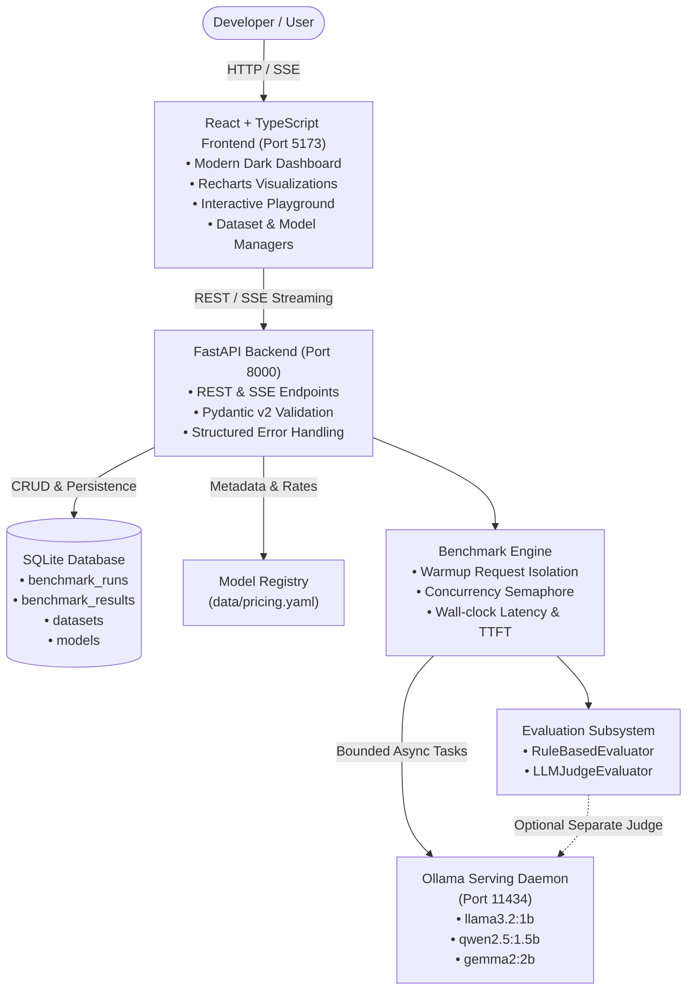

# ModelPicker Architecture

ModelPicker is a production-grade LLM inference, benchmarking, and decision-support platform designed to help engineering teams objectively select the best open-weight model for their target workload based on four key pillars:
1. **Response Quality** (evaluated deterministically or via an independent LLM judge)
2. **End-to-End Latency & TTFT** (actual wall-clock milliseconds)
3. **Inference Cost** (calculated from model registry token pricing)
4. **Weighted Composite Score & Dynamic Recommendation**

---

## High-Level System Architecture

---

## Component Breakdown

### 1. Frontend Layer (`frontend/`)
- **Technology Stack**: React 19, TypeScript, Vite, Tailwind CSS, Lucide Icons, Recharts.
- **Routing & Views**:
  - `/`: Dashboard showcasing top KPIs (Recommended, Fastest, Cheapest, Highest Quality), Recharts comparative charts, and full summary ranking table.
  - `/models`: Live Ollama serving status, installed models overview, and model pull triggers.
  - `/benchmark`: Interactive benchmark configuration (dataset selector, model checkboxes, temperature/tokens sliders, normalized scoring weights) and live background progress polling.
  - `/runs`: Historical benchmark run directory with deletion and navigation.
  - `/runs/:id`: Deep-dive inspector with side-by-side model matrix and expandable prompt outputs.
  - `/datasets`: Custom dataset upload (JSON / JSONL) with schema validator and 10-row preview.
  - `/playground`: Simultaneous multi-model prompt test bench with live TTFT and latency measurements.

### 2. Backend Layer (`backend/app/`)
- **Technology Stack**: Python 3.11, FastAPI, Pydantic v2, SQLAlchemy 2.0, httpx.
- **API Boundaries**: API route handlers only parse and validate requests/responses. All business logic lives in modular, testable services:
  - `OllamaService`: Detects daemon availability, lists installed tags, executes streaming (SSE) and non-streaming inference with nanosecond-resolution wall-clock timing.
  - `ModelRegistryService`: Reads `data/pricing.yaml`, tracks model metadata (context window, parameters, provider), and calculates input/output costs.
  - `BenchmarkService`: Isolates warm-up requests, schedules prompts across models with bounded concurrency (`asyncio.Semaphore`), records prompt-level metrics, and persists run records.
  - `Evaluator`: `RuleBasedEvaluator` computes lexical overlap, concept coverage, and response completeness. `LLMJudgeEvaluator` interfaces with a separate judge model, strictly forbidding models from self-judging.
  - `ScoringService`: Normalizes latency (lower is better), cost (lower is better), and quality (higher is better) on a 0-100 scale, applies weights, and generates dynamic human-readable recommendation rationales.

### 3. Serving & Storage Layer
- **Ollama**: Official containerized Ollama engine exposing port 11434. Models are stored in an isolated Docker volume (`ollama_data`).
- **SQLite**: Local relational database using SQLAlchemy with foreign keys, cascading deletes, and indexed query patterns.
